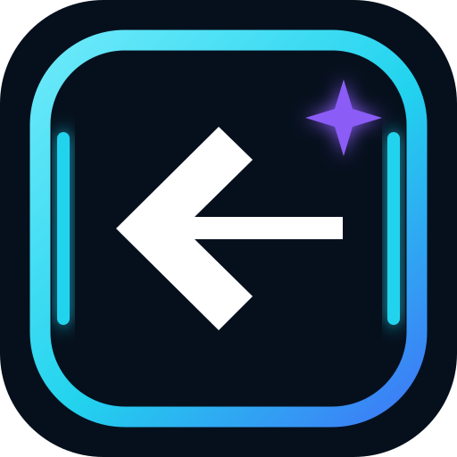

  

# Edge Back Extender

Edge Back Extender voegt een smalle transparante aanraakzone toe net binnen de native Terug-rand van Android. Dit helpt vooral bij hoesjes met een hoge schermrand waardoor het normale Terug-gebaar moeilijk te starten is.

De app vervangt de native zone **niet**. Ze breidt alleen het bruikbare startgebied naar binnen uit en voert de systeemactie Terug uit na een duidelijke horizontale swipe.

## Functies

- Links en rechts afzonderlijk instelbaar.
- Totale Terug-zone instelbaar.
- Swipe-afstand instelbaar.
- Boven- en onderuitsluiting instelbaar.
- Optionele haptische feedback.
- Testmodus om de extra zones zichtbaar te maken.
- Automatische detectie van de native Back-inset wanneer Android die resource aanbiedt.
- Geen root nodig.
- Geen internetpermissie, analytics of uitlezen van scherminhoud.
- App-taal instelbaar vanaf Android 13; anders wordt de systeemtaal gevolgd.

## Talen

Engels, Nederlands, Spaans, Italiaans, Portugees, Frans, Russisch, Hongaars, vereenvoudigd Chinees en traditioneel Chinees.

## Bouwen op Windows

Gebruik `BOUW_EN_INSTALLEER.bat` om te bouwen en meteen via ADB te installeren. Gebruik `BOUW_ALLEEN.bat` als je alleen een APK wilt bouwen.

De APK heet `EdgeBackExtender-v0.2.1.apk`.

### Bestaande installatie bijwerken

Android vereist dezelfde signing key voor updates. Het script zoekt automatisch in naastliggende Edge Back Extender-mappen naar een bestaande `edgeback-local.keystore`. Bewaar die sleutel voor toekomstige versies.

## Privacy

De AccessibilityService heeft `canRetrieveWindowContent=false`. Er is geen `INTERNET`-permission en er worden geen analytics verzameld.

## Licentie

MIT. Zie [LICENSE](LICENSE).
